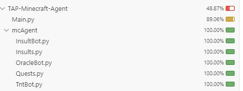

__PROYECT DESCRIPTION__
# Framework for Bot Interaction in Minecraft Server

This framework allows different agents (bots) to interact with players on a Minecraft server. Below is the relevant information for its use and the implementation of new bots.

## Pre-implemented Bots

1. **TNT Bot**:
   - **Functionality**: Detects if a player touches water. If this happens, a TNT box forms around the player, creating a deadly trap.

2. **Insult Bot**:
   - **Functionality**: Detects if a player hits a block with a sword. If so, the bot insults the player through the chat.

3. **Oracle Bot**:
   - **Functionality**: Knows some basic things about Oracle and has the Gemini AI implemented. You need to provide your own API key for it to work.

## Framework Operation

1. **Server Execution**:
   - Download the Minecraft Adventures server from [here](https://github.com/AdventuresInMinecraft/AdventuresInMinecraft-Linux).
   - Accept the EULA to be able to run the server.

2. **Connecting to the Server**:
   - Connect to the server using a Minecraft client 1.12.
   - Enter `localhost` or `127.0.0.1` as the server address.

3. **Framework Execution**:
   - Run the `Main.py` file to start the framework.

4. **Enjoy**:
   - Interact with the bots and enjoy the experience on the server.

## Implementing New Bots

- **Bot Responsibility**:
  - Each bot controls its own thread and functionality.
  - The framework only executes actions if a command is received in the chat, minimizing the need for framework modifications.

- **Creating New Bots**:
  - You can implement your own bots by following the structure and responsibilities mentioned.
  - Ensure the bot properly handles its interaction with players and the server environment.

__MORE STUFF__

The goal of this task is to implement a Python framework enabling the development and execution of Python coded agents in a Shared Minecraft server. Now we will proceed to talk about some design decisions that we took, the testing that we made
and the bots that we implemented in other to see the framework in action.

**MAIN STRUCTURE DECISIONS**
A framework is a structured, pre-defined set of guidelines, tools, and practices designed to simplify and standardize the development of projects. Frameworks provide a foundation that developers can build upon, saving time and reducing 
the complexity of creating solutions from scratch. That's why we decided that the main structure of the framework should be as simple as possible, that way we facilitate the implementation of a new bot.
In the early versions of this framework, almost al the logic behind the bots was in the main, but at the end we decided that it was in our best interest to delegate as much code as we could so that the main was as simple as 3 new lines per bot.
The main advantage about main simplicity is that the new user who wants to implement a new bot to the framework won't have any difficulties in understanding it, that makes it more favorable to be a success. The other main advantage is that
the bots are as separated as possible, meaning that they have the minimum common code possible. With that, the likelihood of someone breaking another bot while trying to add a new one drops notoriously.

**BOT THREADING DECISIONS**
In early versions, as we talked about previously, almost all the logic of the bots was in the main file. That also included the fact that the bots worked in a sequential way. We had a loop that kept hearing new events and depending on the event,
the loop would enter in the section of a new bot and do almost all the logic right there. In this last version we implemented threading, this allows us to have multiple bots working at the same time. This helps with the code delegation, because 
now a thread manages itself and the main code will only be used again in case that the user wants to shut off the bot. This also provides an improved reaction time, eventhought in this scenario it's hardly needed. Also the presented bots work
differently so there is no need for sincronization. In case that someone wants to add a similar bot, a deeper study about the minecraft library should be done.

**BASIC BOT IMPLEMENTATION**
As we mentioned, bots work in their own thread. We also mentioned that we wanted to delegated all the code to the bot itself. That being said, a bot must have a basic structure to be compatible with the framework. The basic structure is basically
a bot initializer which sets a control variable for the thread and creates it. We also have the bot finalizer, which changes the value of the control variable and waits util the thread is finished. The specific implementation might change but
the main idea has to prevail: A method which makes the bot work in a thread. Apart from that everything else is up to the programmer, for example there could be a bot that doesn't turn off.

**INSULTBOT IMPLEMENTATION**
The objective of this bot is to insult the player while he plays. For the bot to be able to respond to the player actions, it has to use de mcpi libraries and start capturing events. In this bot we decided that each time that the player hits a
block the bot is informed and posts a message in the chat in which the bot insults the player. The insults are basically an array with phrases picked randomly.

**ORACLEBOT IMPLEMENTATION**
The objective of this bot is to respond a question from the player. The bot will show some standard questions that can be responded by the bot itself or the player can also choose to be responded by an AI. For doing this we basically had to
use an AI API. The vast majority of them aren't free and decent at the same time until we found Geminis. Geminis is a useful AI that responds decently and one of its versions is free to use in a API.

**TNTBOT IMPLEMENTATION**
What this bot basically does is surround the player with tnt and fire so the tnt explodes each time the player touches water. That way we can test a new type event and try a new funcionality of the minecraft library: the placement of blocks.

**TESTS**
This project provides a framework for testing Minecraft bots using Python's unittest module. The bots—InsultBot, OracleBot, and TntBot—are designed to interact with the Minecraft world via chat commands and in-game events.  The tests are divided
into dynamic and static tests. Dynamic tests simulate real interactions in a live Minecraft environment, while static tests check the internal logic and behavior of the bots without requiring Minecraft. The dynamic tests work by connecting to a 
Minecraft instance and interacting with it in real-time. Commands are sent via the in-game chat, and the test framework monitors the chat and game events to ensure the bots respond correctly. 
For example, the tests activate and deactivate bots using commands like !insultbot on and !insultbot off, validate the bots' behavior when specific actions occur (e.g., hitting blocks or asking questions), and ensure the bots' states update as 
expected. Static tests do not require a live Minecraft connection. They directly test the bots' methods, state changes, and thread management to ensure that the bots behave as intended in isolation. For instance, the static tests validate that 
a bot  can start, perform its tasks, and stop correctly, with its internal flags and threads reflecting the appropriate states.This setup ensures that both the integration of the bots with Minecraft and their individual functionalities are 
thoroughly tested. We also made sure to have as much code coverage as possible to ensure that absolutely all the code works correctly. In the following picture we can see how much code coverage we have.

The overall code coverage is about 48% but that's because it's counting the minecraft library which isn't ours, so really our code coverage is pretty close to 100%.

Creators: Satxa Fortuny and Alfonso Sanchez with URV Support. 
